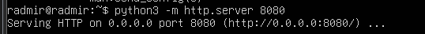
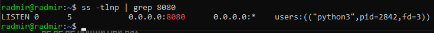
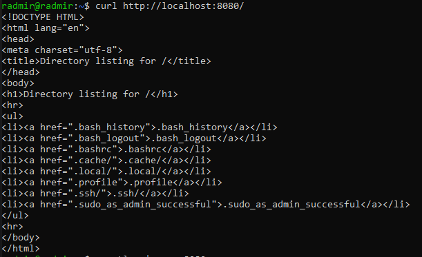
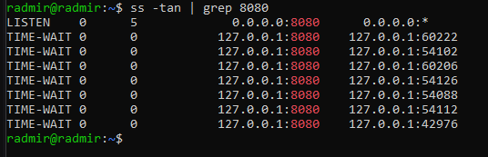
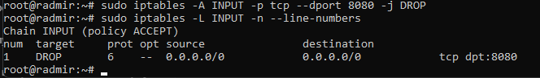
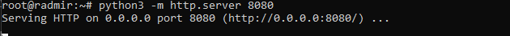
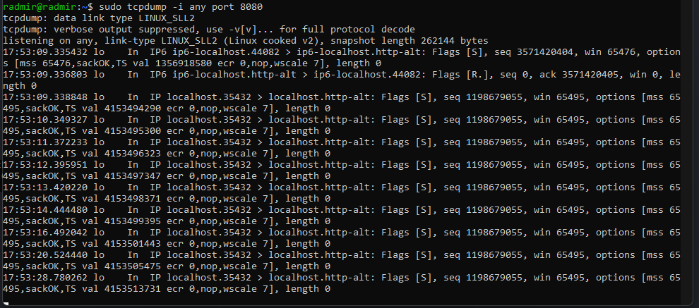
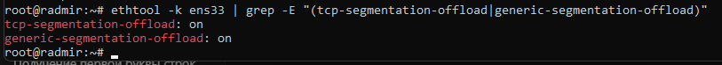

# Лабораторная работа № 3

## Задание 1. Анализ состояний TCP-соединений (25 баллов)
Запустите Python HTTP сервер на порту 8080:
python3 -m http.server 8080

Проверяйте слушающие TCP-сокеты с помощью утилиты ss. найдите сокет с вашим http сервером.

Подключитесь к серверу через curl.

Проанализируйте состояние TCP-сокетов для порта 8080, объясните, почему есть сокет в состоянии TIME-WAIT, его роль и почему его нельзя удалить.

После завершения TCP-соединения, сторона, которая инициировала закрытие (обычно клиент), переводит сокет в состояние TIME-WAIT
Это происходит во время фазы "четырехрукого handshake" при закрытии соединения:
- Клиент отправляет FIN
- Сервер подтверждает ACK
- Сервер отправляет свой FIN
- Клиент подтверждает ACK и переходит в TIME-WAIT
- Опишите, к каким проблемам может привести большое количество TIME-WAIT сокетов.

## Задание 2. Динамическая маршрутизация с BIRD (35 баллов)
Создайте dummy-интерфейс с адресом 192.168.14.88/32, назовите его service_0.

При помощи BIRD проаннонсируйте этот адрес при помощи протокола RIP v2 включенного на вашем интерфейсе (eth0/ens33), а так же любой другой будущий адрес из подсети 192.168.14.0/24 но только если у него будет маска подсети /32 и имя будет начинаться на service_

Создайте ещё три интерфейса:

service_1 192.168.14.1/30

service_2 192.168.10.4/32

srv_1 192.168.14.4/32

С помощью tcpdump докажите, что анонсируются только нужные адреса, без лишних.

## Задание 3. Настройка фаервола/ Host Firewalling (25 баллов)
С помощью iptables или nftables создайте правило, запрещающее подключения к порту 8080.

Запустите веб сервер на питоне и продемонстрируйте работу вашего firewall при помощи tcpdump.

## Задание 4. Аппаратное ускорение сетевого трафика (offloading) (15 баллов)
С помощью ethtool исследуйте offload возможности вашего сетевого адаптера.

Покажите включён ли TCP segmentation offload.

Объясните, какую задачу решает TCP segmentation offload.

TCP Segmentation Offload - это технология аппаратного ускорения, которая передает задачу сегментации TCP-пакетов с центрального процессора на сетевой адаптер.

Проблема:

- При передаче больших объемов данных через сеть, операционная система должна разбивать большие блоки данных на сегменты размером MTU (обычно 1500 байт)
- Эта операция требует значительных вычислительных ресурсов CPU
- Каждый сегмент требует создания TCP-заголовка, расчета контрольных сумм и других операций

Решение TSO:

Операционная система передает сетевому адаптеру один большой буфер данных (до 64KB)
Сетевой адаптер самостоятельно:
- Разбивает данные на сегменты соответствующего размера MTU
- Создает TCP-заголовки для каждого сегмента
- Рассчитывает контрольные суммы
- Передает готовые пакеты в сеть