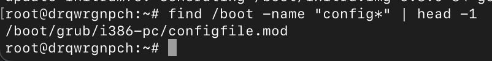

# Лабораторная работа №1

## Задание 1. Kernel and Module Inspection (15 баллов)

* Продемонстрировать версию ядра вашей ОС.

Эта команда выводит версию ядра линукса

* Показать все загруженные модули ядра.

* Отключить автозагрузку модуля cdrom.

* Найти и описать конфигурацию ядра (файл конфигурации, параметр CONFIG_XFS_FS).
  
  

Параметр CONFIG_XFS_FS отвечает за поддержку файловой системы XFS
В моем случае выставлена настройка `CONFIG_XFS_FS=m` это означает, что драйвер файловой системы будет
собран как загружаемый модуль ядра

## Задание 2. Наблюдение за VFS (20 баллов)

Используйте strace для анализа команды cat  /etc/os-release > /dev/null.
Для этого запустите strace -e trace=openat,read,write,close cat/etc/os-release > /dev/null
Описать открываемый и читаемый файл, объяснить отсутствие записывающих вызовов в выводе.

Отсутствие записывающих вызовов связано с тем, что вывод команды направлен в /dev/null,
запись туда происходит фактически, но strace показывает системные вызовы связанные с файлами,
а /dev/null специальное устройство, его запись может не отображаться как обычная запись в файл

## Задание 3. LVM Management (40 баллов)

* Добавить к своей виртуальной машине  диск /dev/sdb размером 2GB.
* Создать раздел на /dev/sdb, используя fdisk или parted.
* Создать Physical Volume (PV) на этом разделе.
* Создать Volume Group (VG) с именем vg_highload.
* Создать два Logical Volume (LV): data_lv (1200 MiB) и logs_lv (оставшееся место).
* Отформатировать data_lv как ext4 и примонтировать в /mnt/app_data.
* Отформатировать logs_lv как xfs и примонтировать в /mnt/app_logs.

## Задание 4. Использование pseudo filesystem (25 баллов)

* Извлечь из /proc модель CPU и объём памяти (KiB).
  
  

* Используя /proc/$$/status, найдите Parent Process ID (PPid) вашего текущего shell. что означает $$ ?
  
$$ - это PID текущего shell (он же процесс)

* Определить настройки I/O scheduler для основного диска /dev/sda.
  
у меня /vda т.к. используется KVM

* Определить размер MTU для основного сетевого интерфейса (например, eth0 или ens33).
  

 