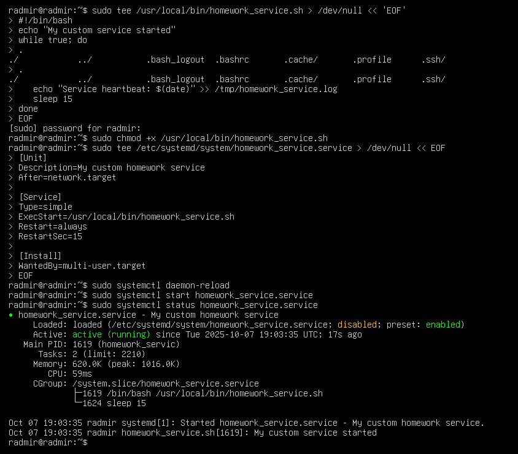
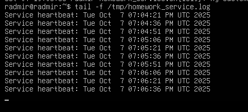
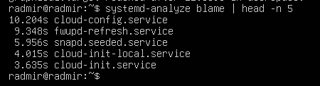
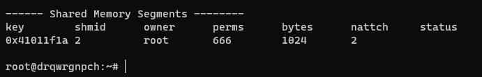
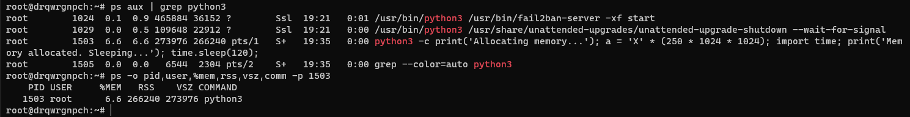
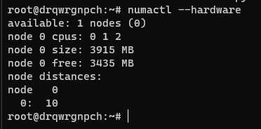
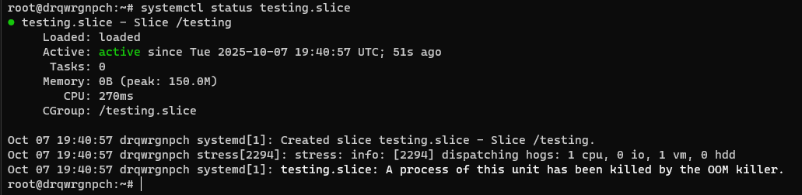

# Лабораторная работа № 2

Выполнил: Мусабаев Радмир

## Задание 1. Systemd (25 баллов)

Создайте bash-скрипт /usr/local/bin/homework_service.sh  

с содержанием:

```bash

#!/bin/bash

echo "My custom service has started."

while true; do

  echo "Service heartbeat: $(date)" >> /tmp/homework_service.log

  sleep 15

done
```
 
Создайте systemd unit файл для скрипта, который бы переживал любые обновления системы. Убедитесь, что сервис сам перезапускается в случае падения через 15 секунд.

Запустите сервис и убедитесь, что он работает.

Используя systemd-analyze, покажите топ-5 systemd unit`ов стартующих дольше всего.



Видим, что сервис запустился, теперь смотрим содержимое файла



Посмотрим топ 5 самых долгих unit-ов



cloud-config.service - Самый долгий по времени запуска. Связан с конфигурацией облака (cloud-init), 
обычно инициализация и настройка системы при старте. Может быть медленным из-за ожидания сетевых или 
облачных ресурсов.

fwupd-refresh.service - Служба обновления прошивки оборудования (firmware update). 
Обновление базы данных прошивок и проверка. Может занимать время, если интернет-соединение 
медленное или серверы недоступны.

snapd.seeded.service - Snap сервис, который завершает инициализацию snap-пакетов. 
Может занимать время при загрузке snap-приложений.

cloud-init-local.service  - Локальная часть cloud-init, запускается до основной cloud-init. 
Связан с начальной конфигурацией.

cloud-init.service - Основная служба cloud-init, инициализирующая систему и настройки.
 
## Задание 2. Межпроцессное взаимодействие (IPC) с разделяемой памятью (20 баллов)

Создайте шареную память:

На любом языке прогаммирования создайте програму использующую шареную память.

Например shm_creator.c:

 
 ```c
#include <stdio.h>
#include <stdlib.h>
#include <sys/ipc.h>
#include <sys/shm.h>
#include <unistd.h>

 
int main() {

    key_t key = ftok("homework_key", 65); // Generate a unique key

    int shmid = shmget(key, 1024, 0666|IPC_CREAT); // Create 1KB segment

    if (shmid == -1) {

        perror("shmget");

        exit(1);

    }

    printf("Shared memory segment created.\n");

    printf("ID: %d\nKey: 0x%x\n", shmid, key);

    printf("Run 'ipcs -m' to see it. Process will exit in 60 seconds...\n");

    sleep(60);

    shmctl(shmid, IPC_RMID, NULL); // Clean up

    printf("Shared memory segment removed.\n");

    return 0;

}
```
 
Скомпилируйте и запустите

 
gcc shm_creator.c -o shm_creator

touch homework_key

./shm_creator

 
Пока программа запущена (60 секунд), проанализируйте вывод:

в соседнем терминале запустите ipcs -m. Обратите внимание на  nattch (number of attached processes) проанализируйте вывод



Можно увидеть, что nattch = 2, т.к. я запустил программу сразу в двух терминалах, еще можно увидеть, что bytes = 1024, так как мы указывали в программе

сама программа:

```c
#include <stdio.h>
#include <stdlib.h>
#include <sys/ipc.h>
#include <sys/shm.h>
#include <string.h>
#include <unistd.h>

int main() {
    key_t key = ftok("homework_key", 65);
    if (key == -1) {
        perror("ftok");
        exit(1);
    }

    int shmid = shmget(key, 1024, 0666 | IPC_CREAT);
    if (shmid == -1) {
        perror("shmget");
        exit(1);
    }

    char *data = (char*) shmat(shmid, (void*)0, 0);
    if (data == (char*) -1) {
        perror("shmat");
        exit(1);
    }

    const char *message = "Hello from shared memory!";
    strncpy(data, message, 1024);

    printf("Shared memory segment created and message written.\n");
    printf("Shared memory ID: %d\n", shmid);
    printf("Key: 0x%x\n", key);
    printf("Run 'ipcs -m' in another terminal to inspect.\n");
    printf("Process will sleep for 60 seconds...\n");

    sleep(60);

    if (shmdt(data) == -1) {
        perror("shmdt");
        exit(1);
    }

    if (shmctl(shmid, IPC_RMID, NULL) == -1) {
        perror("shmctl");
        exit(1);
    }

    printf("Shared memory segment removed.\n");
    return 0;
}
```
 
## Задание 3. Анализ памяти процессов (VSZ vs RSS) (20 баллов)

Откройте 1 окно терминала и запустите питон скрипт, который запрашивает 250 MiB памяти и держит ее 2 минуты

 
python3 -c "print('Allocating memory...'); a = 'X' * (250 * 1024 * 1024); import time; print('Memory allocated. Sleeping...'); time.sleep(120);"

 
Пока скрипт запущен, откройте вторую вкладку, найдите там PID запущенного скрипта и проанализируйте использование RSS и VSZ:

 
ps -o pid,user,%mem,rss,vsz,comm -p %%YOUR_PID%%


Объясните почему vsz больше rss, и почему rss далеко не 0




VSZ (Virtual Set Size) — это общий объём виртуальной памяти, выделенной процессу. Включает все виды памяти: загруженные библиотеки, зарезервированное, но не использованное пространство, а также фактически используемую.

RSS (Resident Set Size) — это объём физической памяти (ОЗУ), который реально занимает процесс сейчас.

Память для строки действительно выделена и используется, что видно в RSS.

Если бы процесс только зарезервировал память, но не писал в неё (не инициализировал), 
то RSS могло бы быть меньше — потому что ОС выделяет физическую память лениво — только когда происходит запись.
 
## Задание 4. NUMA и cgroups (35 баллов)

Продемонстрируйте количество NUMA нод на вашем сервере и количество памяти для каждой NUMA ноды



Убедитесь что вы можете ограничивать работу процессов при помощи systemd.

Запустите 

sudo systemd-run --unit=highload-stress-test --slice=testing.slice \

--property="MemoryMax=150M" \

--property="CPUWeight=100" \

stress --cpu 1 --vm 1 --vm-bytes 300M --timeout 30s

 
Будет ли работать тест если мы запрашиваем 300М оперативной памяти, а ограничивыем 150М?

- Нет, тест не сможет успешно использовать 300М оперативной памяти, если MemoryMax ограничен до 150М. 
Система попытается ограничить использование памяти в cgroup, и при попытке выделить больше 150М процессы 
будут ограничены, а процесс, скорее всего, будет завершён (OOM killer сработает).

В соседней вкладке проследите за testing.slice при помощи systemd-cgls. Привысило ли использование памяти 150М ? Что происходит с процессом при превышении? Попробуйте использовать разные значения 



Опишите что делает и для ччего можно использовать MemoryMax and CPUWeight.

MemoryMax — максимальный объём оперативной памяти (RAM), который может использоваться процессами в cgroup. 
Это ограничение помогает предотвратить чрезмерное потребление памяти, которое может повлиять на стабильность системы.

CPUWeight — вес (приоритет) в планировщике CPU для данной cgroup. Чем выше значение, тем больше времени CPU 
будет выделено этой группе по сравнению с другими. Значения обычно от 1 до 10000.