# Лабораторная работа № 4

## Задание 1. Создание Server Pool для backend (10 баллов)
Создайте у себя в home dir 2 папки ~/backend1 и ~/backend2, в каждой из которых должен лежать 1 index.html

```
"<h1>Response from Backend Server 1</h1>" для backend1

"<h2>*** Response from Backend Server 2 ***</h2>"  для backend2
```

внутри этих папок запустите питоновый http сервер на портах 8081 и 8082 соответсвенно.

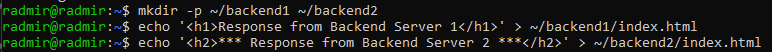

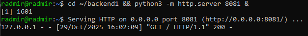

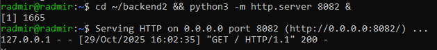

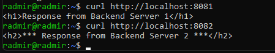

## Задание 2. DNS Load Balancing с помощью dnsmasq (20 баллов)
При помощи dnsmasq создайте 2 A записи 

my-awesome-highload-app.local,127.0.0.1

my-awesome-highload-app.local,127.0.0.2

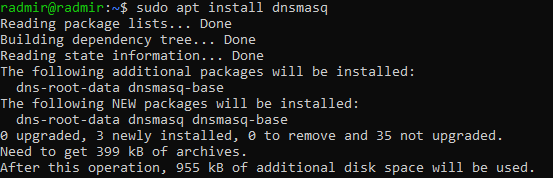

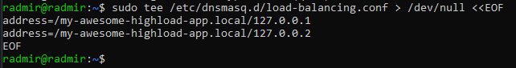

 
Запустите  dnsmasq и при помощи dig обратитесь к 127.0.0.1 для резолва my-awesome-highload-app.local


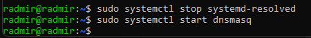

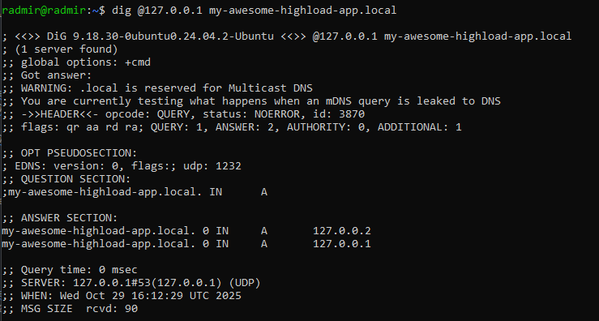
 
Проанализируйте вывод, что произойдет с DNS записями если backend2 сервер сломается? 

Можно увидеть, что вернулись обе А-записи 

```
;; ANSWER SECTION:
my-awesome-highload-app.local. 0 IN     A       127.0.0.2
my-awesome-highload-app.local. 0 IN     A       127.0.0.1
```

Если backend2 сломается, DNS все равно будет возвращать оба IP-адреса

Т.к. DNS не знает о состоянии серверов, клиенты будут получать неработающие IP


## Задание 3. Балансировка Layer 4 с  с помощью IPVS (35 баллов)
Создайте dummy1 интерфейс с адресом 192.168.100.1/32

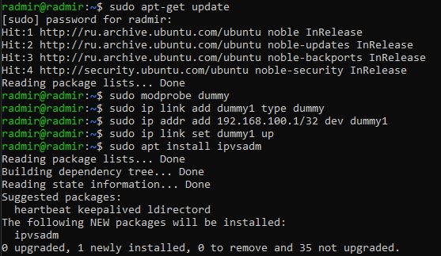

Используя ipvsadm создайте VS для TCP порта 80 ведущего в 127.0.0.1:8081 и 127.0.0.1:8082 использующего round-robin тип балансировки.

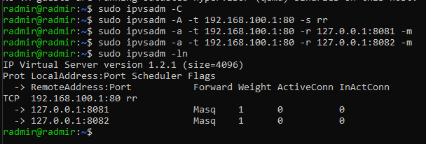
 
Используя curl сходите в http://192.168.100.1 продемонстрируйте счетчики на ipvs, убедитесь, что балансировка происходит. 

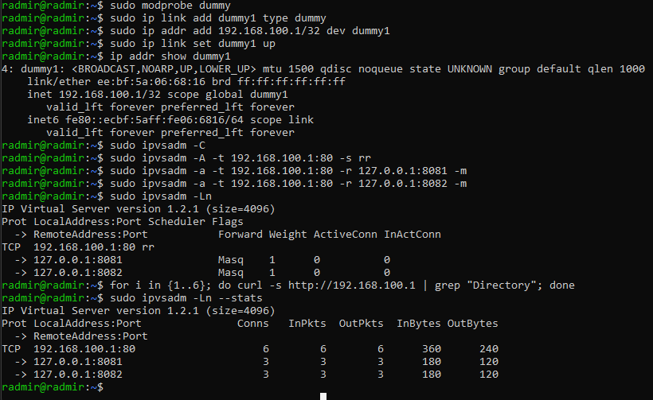

## Задание 4. Балансировка L7 с помощью NGINX (35 баллов)

Создайте пул из  127.0.0.1:8081 и 127.0.0.1:8082 в nginx с active-backup балансировкой.

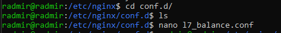

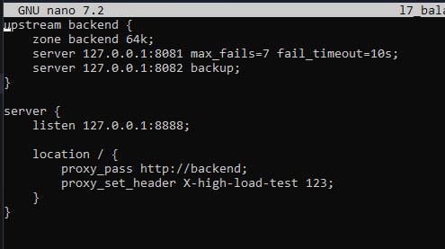

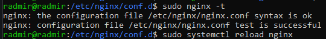

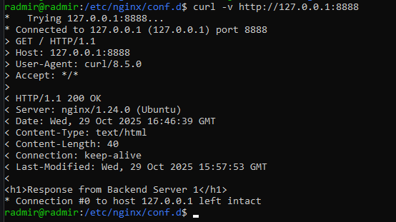

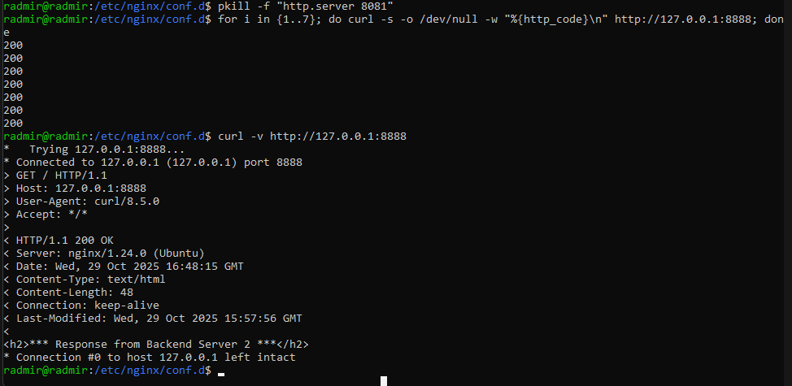

Убедитесь, что переключение на backup сервер происходит после 7 неудачных попыток сходить в активный сервер.